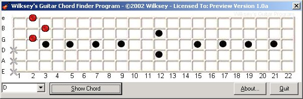

<div align="center">

## Guitar Chord Finder


</div>

### Description

Displays Chords, mainly for beginner guitarists, wanting to learn chords.
 
### More Info
 
Basic understanding of a Guitar Fret board.

A Display of a chord

None im aware of


<span>             |<span>
---                |---
**Submitted On**   |2002-07-01 02:39:36
**By**             |[Wilksey\!](https://github.com/Planet-Source-Code/PSCIndex/blob/master/ByAuthor/wilksey.md)
**Level**          |Intermediate
**User Rating**    |4.3 (13 globes from 3 users)
**Compatibility**  |VB 6\.0
**Category**       |[Miscellaneous](https://github.com/Planet-Source-Code/PSCIndex/blob/master/ByCategory/miscellaneous__1-1.md)
**World**          |[Visual Basic](https://github.com/Planet-Source-Code/PSCIndex/blob/master/ByWorld/visual-basic.md)
**Archive File**   |[Guitar\_Cho1004046302002\.zip](https://github.com/Planet-Source-Code/wilksey-guitar-chord-finder__1-36415/archive/master.zip)

### API Declarations

```
Note: I got the images from A website, some from www.ws64.com
I will update this in the future for Barre Chords.
```


